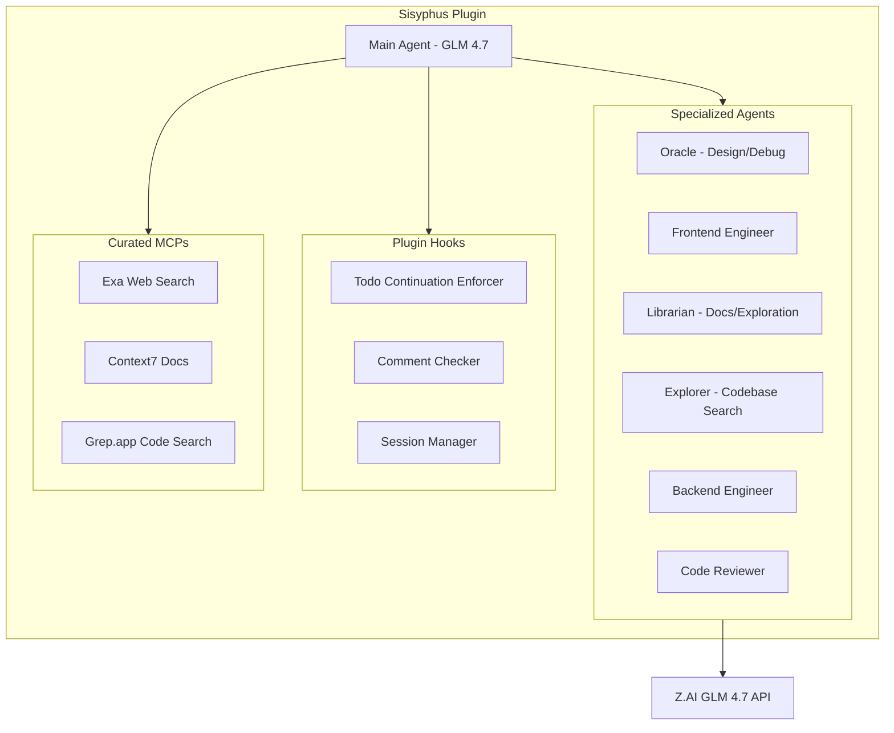

# Sisyphus: Custom OpenCode Plugin for Z.AI GLM 4.7

## Overview

Build a comprehensive OpenCode plugin that orchestrates multiple specialized agents, all powered by GLM 4.7 through Z.AI. The plugin will be installed globally at `~/.config/opencode/plugin/` and provide:

- 6 specialized agents with distinct roles
- Todo Continuation Enforcer (keeps the "boulder rolling")
- Comment Checker (ensures clean, human-like code)
- Curated MCPs integration (Exa, Context7, Grep.app)
- Session management and context optimization

## Architecture




## Plugin Structure

```javascript
~/.config/opencode/plugin/
└── sisyphus/
    ├── index.ts              # Main plugin entry point
    ├── agents/
    │   ├── oracle.ts         # Design & debugging agent
    │   ├── frontend.ts       # Frontend UI/UX agent
    │   ├── librarian.ts      # Docs & exploration agent
    │   ├── explorer.ts       # Fast codebase search agent
    │   ├── backend.ts        # Backend engineering agent
    │   └── reviewer.ts       # Code review agent
    ├── hooks/
    │   ├── todo-enforcer.ts  # Ensures tasks complete
    │   ├── comment-checker.ts # Prevents excessive comments
    │   └── session-manager.ts # Context optimization
    ├── mcps/
    │   └── config.ts         # MCP configurations
    ├── utils/
    │   ├── prompts.ts        # Agent system prompts
    │   └── helpers.ts        # Shared utilities
    └── oh-my-sisyphus.json   # Plugin configuration
```


## Implementation Details

### 1. Main Plugin Entry Point (`index.ts`)

The plugin exports the main function that:

- Initializes all specialized agents
- Registers event hooks (tool.execute.before, session.idle, todo.updated)
- Configures MCP servers
- Provides the `client` SDK for agent orchestration

### 2. Specialized Agents

Each agent has a specific system prompt and role:| Agent | Role | Specialization ||-------|------|----------------|| Oracle | Design/Debug | Architecture decisions, complex debugging, problem-solving || Frontend | UI/UX | React/Next.js, styling, component design, accessibility || Librarian | Research | Official docs lookup, open-source implementations, codebase history || Explorer | Search | Fast contextual grep, file discovery, pattern matching || Backend | Engineering | API design, database, server-side logic, performance || Reviewer | Quality | Code review, best practices, security, maintainability |

### 3. Core Hooks

**Todo Continuation Enforcer:**

- Listens to `session.idle` and `todo.updated` events
- If todos remain incomplete, prompts agent to continue
- Implements the "Sisyphus rolling the boulder" philosophy

**Comment Checker:**

- Hooks into `tool.execute.after` for file edits
- Detects excessive AI-style comments
- Prompts cleanup to ensure human-like code

**Session Manager:**

- Monitors context window usage
- Triggers compaction with domain-specific context
- Preserves critical information during summarization

### 4. Configuration File (`oh-my-sisyphus.json`)

```json
{
  "agents": {
    "oracle": { "enabled": true },
    "frontend": { "enabled": true },
    "librarian": { "enabled": true },
    "explorer": { "enabled": true },
    "backend": { "enabled": true },
    "reviewer": { "enabled": true }
  },
  "hooks": {
    "todo_enforcer": true,
    "comment_checker": true,
    "session_manager": true
  },
  "mcps": {
    "exa": true,
    "context7": true,
    "grep_app": true
  }
}
```


## Prerequisites

1. **OpenCode installed** with Z.AI authenticated:
   ```bash
         opencode auth login  # Select Z.AI Coding Plan
   ```


2. **GLM 4.7 model selected** in OpenCode:
   ```bash
         /models  # Select GLM 4.7
   ```


3. **Global plugin directory exists**:
   ```bash
         mkdir -p ~/.config/opencode/plugin/sisyphus
   ```


## Key Features from Oh My OpenCode (Adapted)

- **Async Agent Delegation**: Agents can work in parallel on different aspects
- **LSP Integration**: Leverages OpenCode's built-in LSP tools for refactoring
- **Aggressive Context Management**: Smart truncation and compaction
- **Ultra Think Mode**: Deep reasoning command for complex problems
- **Claude Code Compatibility**: Similar hook patterns (PreToolUse, PostToolUse)

## Files to Create

1. `~/.config/opencode/plugin/sisyphus/index.ts` - Main plugin
2. `~/.config/opencode/plugin/sisyphus/agents/*.ts` - Agent definitions